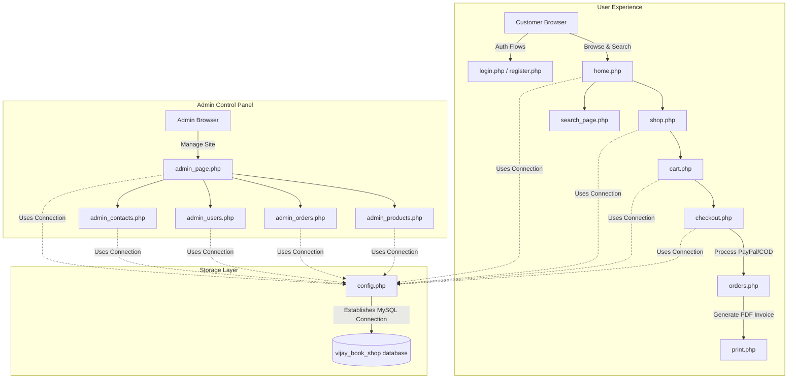

# 📚 Boi Mela - Online Book Shop

<div align="center">

[](LICENSE)
[](https://www.php.net/)
[](https://www.mysql.com/)
[](TCPDF/)
[](https://developer.paypal.com/)

<p align="center">
  <strong>A premium, modern, and feature-rich PHP/MySQL e-commerce platform for literature enthusiasts.</strong>
</p>

</div>

---

Boi Mela is a web-based Online Book Shop designed to provide users with an intuitive shopping experience to browse, search, and purchase books. It comes complete with a comprehensive administrative control panel for managing products, orders, users, and customer feedback messages.


## 🗺️ System Architecture



---

## ✨ Features

### 👤 Customer Experience
*   🔑 **Secure Session Auth**: Secure authentication and custom session tracking ([login.php](login.php) & [register.php](register.php)).
*   📚 **Interactive Catalog**: Browse books by category with custom pagination and book covers ([shop.php](shop.php)).
*   🔍 **Live Search**: Rapid database query filters to find specific book titles instantly ([search_page.php](search_page.php)).
*   🛒 **Dynamic Cart**: Add, update quantities, or remove items on the fly ([cart.php](cart.php)).
*   💳 **Checkout Flow**: Complete shipping address entry and payment gateway selection ([checkout.php](checkout.php)).
*   🏦 **PayPal Sandbox**: Integrated virtual checkout sandbox allowing instant test payments ([orders.php](orders.php)).
*   📄 **PDF Invoice Downloads**: Generates and compiles professional PDF invoices powered by TCPDF ([print.php](print.php)).

### 🔑 Administrative Dashboard
*   📊 **Analytics & Metrics Overview**: Graphical summaries of total orders, order statuses, and customer inquiries ([admin_page.php](admin_page.php)).
*   📦 **Inventory Management Grid**: Add new titles (with metadata, pricing, book covers, and stock counts) and update records ([admin_products.php](admin_products.php)).
*   🚚 **Order Fulfillment & Tracking**: View all sales, modify payment status, or delete canceled transactions ([admin_orders.php](admin_orders.php)).
*   👥 **User Account Control**: Complete listing of registered customer and admin accounts with deletion rights ([admin_users.php](admin_users.php)).
*   ✉️ **Feedback Message Center**: Central inbox for messages sent via customer contact forms ([admin_contacts.php](admin_contacts.php)).

---

## 📂 Codebase Directory Map

```text
online-shop/
├── TCPDF/                   # PDF generation library
├── css/                     # Front-end styling sheets
├── js/                      # Interactive client-side scripts
├── images/                  # Book covers, UI illustrations, and banners
├── config.php               # Database configuration and connection script
├── header.php / footer.php  # Reusable page templates
├── sendmail.php             # PHPMailer script for mail notifications
├── success.php              # Payment landing callback
├── print.php                # Invoice compiler (PDF output)
├── vijay_book_shop.sql      # Database schema and mock records
└── [pages].php              # PHP functional web pages
```

---

## 🚀 Installation & Local Environment Setup

> [!NOTE]
> This application requires local web hosting server software such as **XAMPP**, **WAMP**, or a native PHP and MySQL stack configured on your local machine.

### Step 1: Clone the Project
```bash
git clone https://github.com/vijaymahes9080/online-shop-php.git
cd online-shop-php
```

### Step 2: Initialize the Database
1.  Launch **phpMyAdmin** on your local server.
2.  Create a new empty database named `vijay_book_shop`.
3.  Import the schema file: [vijay_book_shop.sql](vijay_book_shop.sql).

### Step 3: Configure Database Settings
Verify database details in [config.php](config.php):
```php
$conn = mysqli_connect('localhost', 'root', '', 'vijay_book_shop') or die('connection failed');
```

### Step 4: Run the Application
1.  Move the project directory to your web server root (e.g., `htdocs` for XAMPP, `www` for WAMP).
2.  Start Apache and MySQL services.
3.  Open `http://localhost/online-shop-php/` in your browser.

---

## 🤝 Contributing
Contributions are welcome! Please follow these steps:
1.  Fork the repository.
2.  Create your feature branch (`git checkout -b feature/AmazingFeature`).
3.  Commit your modifications (`git commit -m 'Add some feature'`).
4.  Push changes (`git push origin feature/AmazingFeature`).
5.  Open a Pull Request.

---

## 📄 License
Licensed under the MIT License. See [LICENSE](LICENSE) for more details.

---

## 📞 Author & Developer
*   **Author**: Vijay Mahes
*   **GitHub**: [@vijaymahes9080](https://github.com/vijaymahes9080)
*   **Email**: [vijaypradhap2004@gmail.com](mailto:vijaypradhap2004@gmail.com)
